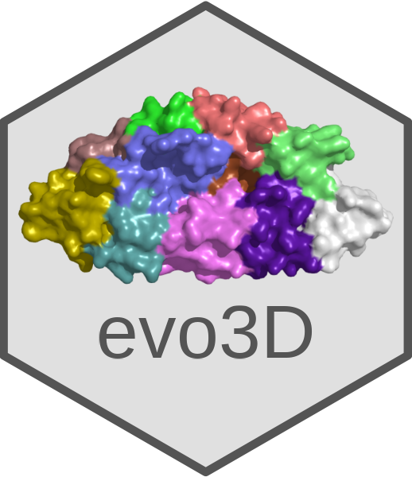

# evo3D


**evo3D** is an R package for structure-aware population genetics, enabling patch-level evolutionary analysis of protein surfaces. It integrates selection metrics with 3D structural data to identify spatially clustered signals of diversity and selection.

`evo3D` supports multi-chain proteins, multi-structure model inputs, and direct assesment of protein-protein interfaces.

---

## Key Features

- Computes selection metrics (π, haplotype diversity, Tajima’s D) at surface-defined patches
- Detects and integrates antibody epitopes from PDB structures
- Supports multi-chain and multi-model PDBs for robust structural inference
- Maps structure-defined residues to codon-aligned MSA windows
- Generates B-factor-encoded PDBs and per-residue selection tables
- Fully self-contained: no reliance on DSSP, MAFFT, or external alignment tools

---

## Installation

To install from GitHub:

```r
# 1. Install evo3D (and devtools if you don’t have it)

if (!requireNamespace("devtools", quietly = TRUE)) {
  install.packages("devtools")
}
devtools::install_github("bbroyle/evo3D")

# 2. Install msa (necessary for msa to pdb alignments)
# this package can take a while to install,
# we may switch in future to DECIPHER or BioStrings

if (!requireNamespace("BiocManager", quietly = TRUE)) {
  install.packages("BiocManager")
}
BiocManager::install("msa", update = FALSE)

```

## Quick Example

```r
library(evo3D)

msa_path <- system.file("extdata", "rh5_pfalc.fasta", package = "evo3D")
pdb_path <- system.file("extdata", "rh5_4wat.pdb", package = "evo3D")

# run_evo3D is designed for single analysis runs -- all input data will return with one results$evo3d_df results table #
# chain = 'auto' by default or set to 'A' for this example #
results <- run_evo3d(msa_path, pdb_path, chain = 'A') 

write_stat_to_bfactor(results, stat_name = "hap", outfile = "rh5_hap_div.pdb")
```

## Running step-wise evo3D modules (more control)  

```r
library(evo3D)

# we will use the same data as first example #
msa_path <- system.file("extdata", "rh5_pfalc.fasta", package = "evo3D")
pdb_path <- system.file("extdata", "rh5_4wat.pdb", package = "evo3D")

# read in msa #
msa_info <- msa_to_ref(msa_path)

# can run .auto_detect_chain(msa_info$pep, pdb_path) #
# can also run .plot_chain_map(pdb_path) to see your protein in 2D with chain info #

# read in pdb #
# pdb_to_patch() has no msa info so 'auto' chain is not valid (see above) #
pdb_info <- pdb_to_patch(pdb_path = pdb_path, chain = 'A')
  
# generate alignment between msa and pdb / and create msa_subsets #
aln_info <- aln_msa_to_pdb(msa_info, pdb_info, chain = 'A', coverage_plot = T)
  
# calculate selection #
selection_df <- run_pegas_three(aln_info$msa_subsets, aln_info$aln_df)

```


## License

This package is released under the MIT License.  
The structural solvent accessibility logic is adapted from the [DSSP project](https://github.com/PDB-REDO/dssp),  
licensed under the BSD 2-Clause License. See `inst/LICENSE.note` for details.

## Conatct

Brad Broyles  
PhD Candidate, Computational and Structural Biology  
Purdue University  
bbroyle@purdue.edu

## Running multi-chain (heterodimer)

```r
library(evo3D)

# two msa's for e1e2 complex #
msa_path1 <- system.file("extdata", "e1_hepc.aln", package = "evo3D")
msa_path2 <- system.file("extdata", "e2_hepc.aln", package = "evo3D")
pdb_path <- system.file("extdata", "e1e2_8fsj.pdb", package = "evo3D")

# FIRST WAY - use wrapper #
results = run_evo3d(list(msa_path1, msa_path2), pdb_path) # 'auto' chain will handle mapping

# SECOND WAY - by module #

# process each MSA #
msa_info1 <- msa_to_ref(msa_path1)
msa_info2 <- msa_to_ref(msa_path2)

# process 1 pdb #
pdb_info <- pdb_to_patch(pdb_path, chain = c('A', 'E'))

# each chain gets a alignment to msa #
aln_info1 <- aln_msa_to_pdb(msa_info1, pdb_info, chain = 'A')

aln_info2 <- aln_msa_to_pdb(msa_info2, pdb_info, chain = 'E')

# build cross chain msa subsets #
aln_info_combined <- extend_msa(aln_info1, aln_info2, list(msa_info1, msa_info2))

# calculate selection #
selection_df <- run_pegas_three(aln_info_combined$msa_subsets, aln_info_combined$aln_df)

```

## Running multi-chain (homotrimer)

```r
library(evo3D)

msa_path <- system.file("extdata", "spike_sarscov2.fa", package = "evo3D")
pdb_path <- system.file("extdata", "spike_7fb0.pdb", package = "evo3D")

# FIRST WAY - with wrapper #
# overload chain information #
results = run_evo3d(msa_path, pdb_path, chain = 'ABC')

# SECOND WAY - by modules #

# read in one msa #
msa_info <- msa_to_ref(msa_path)

# read in pdb ** note distance method set to 'ca' ~ faster (but not required) ** #
pdb_info <- pdb_to_patch(pdb_path, chain = c('A', 'B', 'C'), distance_method = 'ca')

# each chain gets a alignment to msa #
aln_info1 <- aln_msa_to_pdb(msa_info, pdb_info, chain = 'A')
aln_info2 <- aln_msa_to_pdb(msa_info, pdb_info, chain = 'B')
aln_info3 <- aln_msa_to_pdb(msa_info, pdb_info, chain = 'C')

# build cross chain msa subsets #
aln_info_combined <- extend_pdb_homomultimer(list(aln_info1, aln_info2, aln_info3), msa_info)
  
# calculate selection #
selection_df <- run_pegas_three(aln_info_combined$msa_subsets, aln_info_combined$aln_df)

```

## Running multi model (complementary resolved regions in PDB) -- change to Rh5 #

```r
library(evo3D)

msa_path <- system.file("extdata", "spike_sarscov2.fa", package = "evo3D")
pdb_path1 <- system.file("extdata", "spike_7fb0.pdb", package = "evo3D")
pdb_path2 <- system.file("extdata", "spike_7fb1.cif", package = "evo3D")

# read in MSA #
msa_info <- WRAPPER_msa_to_ref(msa_path = msa_path)

# read in pdb #
pdb_info1 <- WRAPPER_pdb_to_patch(pdb_path = pdb_path1,
                                chain = c('A'))

pdb_info2 <- WRAPPER_pdb_to_patch(pdb_path = pdb_path2,
                                 chain = c('A'))

# each chain gets a alignment to msa #
aln_info1 <- WRAPPER_align_msa_pdb(msa_info = msa_info,
                                 pdb_info = pdb_info1, 
                                 chain = 'A')

aln_info2 <- WRAPPER_align_msa_pdb(msa_info = msa_info,
                                  pdb_info = pdb_info2, 
                                  chain = 'A')

# extend capture windows based on complimentary structures #
merged_nuc_windows <- extend_nuc_windows(aln_info1$nuc_patches, 
                                        aln_info2$nuc_patches)

# generate msa subsets using combined window information #
msas <- extract_msa_subsets(msa_info$msa_mat, merged_nuc_windows)
 
# calculate selection ~ dataframe is based on codon position in msa #
selection_df <- run_pegas_three(msas)

```

## Running selection (including epitope) ** NEEDS WORK **

```r
library(evo3D)

msa_path <- system.file("extdata", "rh5_pfalc.fasta", package = "evo3D")
pdb_path <- system.file("extdata", "rh5_6rcu.pdb", package = "evo3D")

# read in MSA #
msa_info <- WRAPPER_msa_to_ref(msa_path = msa_path)

# read in pdb #
pdb_info <- WRAPPER_pdb_to_patch(pdb_path = pdb_path, chain = 'A')

# grab epitope information #
pdb <- .standardize_pdb_input(pdb_path = pdb_path, chain = 'all')
epitope_info1 <- identify_epitopes(pdb, ag_chain = 'A', h_chain = 'B', l_chain = 'C')
epitope_info2 <- identify_epitopes(pdb, ag_chain = 'A', h_chain = 'D', l_chain = 'E')

# add to residue_df
pdb_info$residue_df[nrow(pdb_info$residue_df) + 1,] <- NA
pdb_info$residue_df[nrow(pdb_info$residue_df), 8] <- 'epi:BC>A'
pdb_info$residue_df[nrow(pdb_info$residue_df), 9] <- epitope_info1$epitope

pdb_info$residue_df[nrow(pdb_info$residue_df) + 1,] <- NA
pdb_info$residue_df[nrow(pdb_info$residue_df), 8] <- 'epi:DE>A'
pdb_info$residue_df[nrow(pdb_info$residue_df), 9] <- epitope_info2$epitope

# generate alignment between msa and pdb / and create msa_subsets #
aln_info <- WRAPPER_align_msa_pdb(msa_info = msa_info,
                                 pdb_info = pdb_info, 
                                 chain = 'A', coverage_plot = T)

# calculate selection #
selection_df <- run_pegas_three(aln_info$msa_subsets, pdb_info$residue_df)

```
