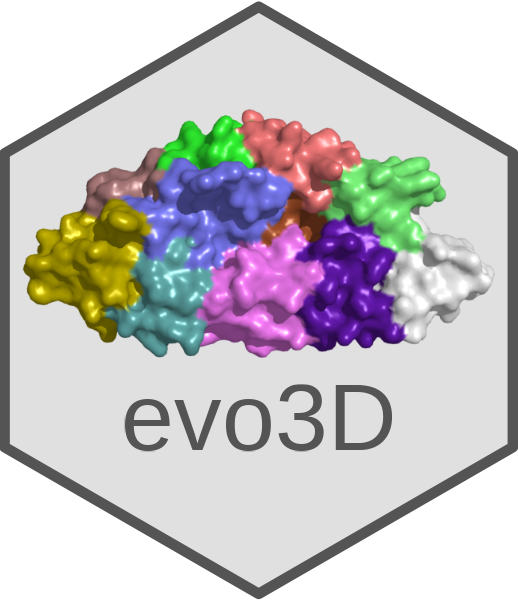
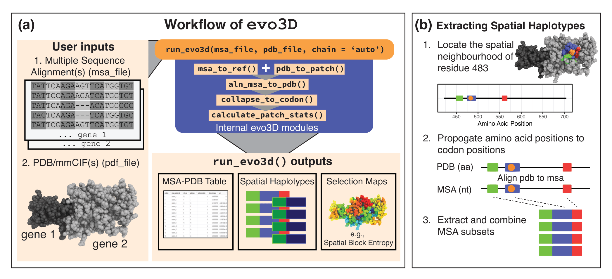

#  **Structure-informed evolutionary analysis in R**

evo3D is a newly released package. If you encounter issues, have suggestions, 
or would like to request new features, please open an issue - community feedback is appreciated.

The package automates the mapping of multiple sequence alignments (MSAs) to protein structures (PDBs), generates 3D sliding windows across the structure, converts structural windows into codon-indexed windows, and subsets MSAs accordingly. These subsets (_spatial haplotypes_) are returned to users along with the codon-indexed windows, enabling flexible user-defined downstream analyses.

---


evo3D workflow and spatial haplotype extraction.

(A) Inputs are a multiple sequence alignment (MSA) (nucleotide or amino acid) and a PDB/mmCIF structure (single chain or complex). In the example of user inputs, two gene MSA’s correspond to one protein complex. run_evo3d() automatically maps structure chains to MSAs, defines 3D neighborhoods (patches), aligns the PDB sequence to the MSA, and computes spatial haplotype statistics. Outputs include an MSA-PDB mapping table, spatial haplotypes (MSA subsets) (optionally written to file), and selection maps projected onto the structure. (B) Spatial haplotypes are constructed by (1) defining a 3D neighborhood around a centroid residue (tunable parameters control neighborhood definition); (2) propagating residue positions to codon positions via the PDB→MSA map; and (3) extracting and concatenating those MSA columns to generate spatial haplotypes. Abbreviations: aa, amino acid; nt, nucleotide.

## Installation Instructions
```r
# 1. Install evo3D (and devtools if needed)
if (!requireNamespace("devtools", quietly = TRUE)) {
  install.packages("devtools")
}

devtools::install_github("bbroyle/evo3D")

# 2. Install msa (used for MSA–structure alignment)
# ! Note: this package can take some time to install !
if (!requireNamespace("BiocManager", quietly = TRUE)) {
  install.packages("BiocManager")
}

BiocManager::install("msa", update = FALSE)
```

## Notes on file formating before running (including current issue processing AlphaFold3 outputs)
1. The MSA file (nucleotide or protein) needs to be aligned sequences, and if nucleotide then coding strand only and in frame.
2. The structure file can be ".pdb" or ".cif" formats. At this time AlphaFold3 ".cif" output is not processed properly (AlphaFold2 outputs are fine).

   converting AlphaFold3 from .cif to .pdb fixes this issue, which can be performed online:
   https://project-gemmi.github.io/wasm/

   or locally by installing GEMMI python package (https://gemmi.readthedocs.io/en/latest/install.html)

3. Non-canonical amino acids that are stored in as HETATM in the structure file are currently not included in MSA to PDB mappings, and are excluded from spatial windows.

   If desired converting HETATM to ATOM will force these residues into MSA to PDB mappings (see tutorials below)


## Quick Run
```r
library(evo3D)

# example data shipped with the package #
msa <- system.file("extdata", "rh5_pfalc.fasta", package = "evo3D")
pdb <- system.file("extdata", "rh5_6mpv_AB.pdb", package = "evo3D")

# adding a few statistics to be calculated *stats_controls* #
results <- run_evo3d(msa, pdb,
  stat_controls = list(calc_site_entropy = TRUE, calc_pi = TRUE),
  detail_level = 2)

# this data frame stores the stats, msa-pdb mapping, and codon-indexed windows #
res_df <- results$evo3d_df

# each 3D window creates a subset of the MSA -- they are stored here #
msa_subs <- results$final_msa_subsets

# these subsets (spatial haplotypes) can be written to file #
write_patch_fastas(msa_subs, output_dir = "testing")

# any statistics calculated could also be mapped to the structure file provided #
write_stat_to_pdb(results, stat_name = c('site_entropy', 'pi'), outfile = 'example_run.pdb')
```

## Tutorials

For detailed walkthroughs and example workflows, see the evo3D tutorials repository:

https://bbroyle.github.io/evo3D_tutorials/


## License

This package is released under the MIT License.  
The structural solvent accessibility logic is adapted from the
[DSSP project](https://github.com/PDB-REDO/dssp),
which is licensed under the BSD 2-Clause License.
See `inst/LICENSE.note` for details.

## Preprint

A preprint describing the evo3D framework and methodology is available at:  
https://doi.org/10.64898/2025.12.12.694041

## Cite

```bibtex
@article{broyles2025evo3d,
  title   = {evo3D: a generalised framework for structure-informed evolutionary analysis, implemented in R},
  author  = {Broyles, Bradley Keith and He, Qixin},
  year    = {2025},
  doi     = {10.64898/2025.12.12.694041},
  url     = {https://doi.org/10.64898/2025.12.12.694041},
  note    = {Preprint}
}
```

## Contact

Brad Broyles  
PhD Candidate, Computational and Structural Biology  
Purdue University  
bbroyle@purdue.edu

